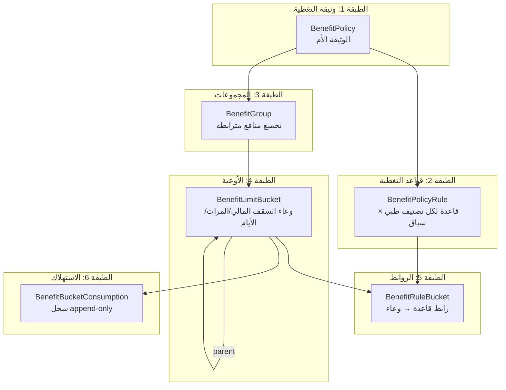
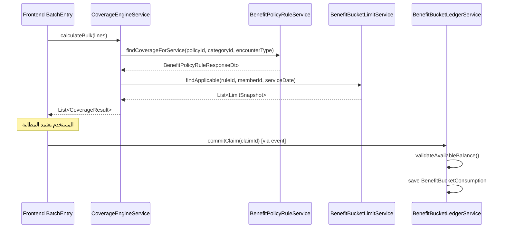

# تحليل صارم: نظام قواعد التغطية والمجموعات والأوعية

> تحليل معماري شامل بصفة كبير المهندسين — يغطي كل جوانب النظام من حيث: تغطية الحالات، المرونة، تجربة المستخدم، الدقة المالية، التتبع، والتكامل.

---

## 🏗️ البنية العامة للنظام



### الكيانات الأساسية

| الكيان | الدور | الملف |
|--------|-------|-------|
| [BenefitPolicy](file:///d:/tba_waad_system-main_success/tba_waad_system-main/backend/src/main/java/com/waad/tba/modules/benefitpolicy/entity/BenefitPolicy.java) | الوثيقة الأم — سقف سنوي، نسبة تغطية افتراضية، حدود الفرد/العائلة | 197 سطر |
| [BenefitPolicyRule](file:///d:/tba_waad_system-main_success/tba_waad_system-main/backend/src/main/java/com/waad/tba/modules/benefitpolicy/entity/BenefitPolicyRule.java) | قاعدة تغطية لتصنيف طبي ضمن سياق محدد | 246 سطر |
| [BenefitGroup](file:///d:/tba_waad_system-main_success/tba_waad_system-main/backend/src/main/java/com/waad/tba/modules/benefitpolicy/entity/BenefitGroup.java) | تجميع منطقي لعدة قواعد تتشارك سقفاً | 57 سطر |
| [BenefitLimitBucket](file:///d:/tba_waad_system-main_success/tba_waad_system-main/backend/src/main/java/com/waad/tba/modules/benefitpolicy/entity/BenefitLimitBucket.java) | وعاء السقف الفعلي (مبلغ/مرات/أيام) | 43 سطر |
| [BenefitRuleBucket](file:///d:/tba_waad_system-main_success/tba_waad_system-main/backend/src/main/java/com/waad/tba/modules/benefitpolicy/entity/BenefitRuleBucket.java) | جدول ربط بين قاعدة ووعاء | 25 سطر |
| [BenefitBucketConsumption](file:///d:/tba_waad_system-main_success/tba_waad_system-main/backend/src/main/java/com/waad/tba/modules/benefitpolicy/entity/BenefitBucketConsumption.java) | سجل استهلاك append-only مع idempotency | 35 سطر |

---

## ✅ نقاط القوة (ما تم تحقيقه بشكل ممتاز)

### 1. معمارية الأوعية (Bucket Architecture) — ⭐⭐⭐⭐⭐
- **Append-only ledger** مع `idempotencyKey` يمنع التكرار حتى في حالات إعادة المحاولة
- **PESSIMISTIC_WRITE lock** عند `findByIdForUpdate` يمنع race conditions
- **حراسة fail-closed** عبر `existsUnledgeredApprovedBucketClaim` تكشف المطالبات المعتمدة التي لم تُرحّل
- **Reversal مالي** سليم: يُنشئ سجل عكسي مع ربط `reversalOf` بدلاً من الحذف
- **3 أبعاد للسقوف**: مبلغ + مرات + أيام — مرونة نادرة في أنظمة TPA

### 2. تعدد الفترات الزمنية — ⭐⭐⭐⭐⭐
```
PER_SERVICE | PER_VISIT | DAILY | MONTHLY | ANNUAL | MULTI_YEAR_POLICY | POLICY_PERIOD | LIFETIME
```
تغطية شاملة لكل السيناريوهات الواقعية بما في ذلك:
- **MULTI_YEAR_POLICY** لعقود طويلة المدة مع حساب الدورة الحالية
- **LIFETIME** لسقوف مدى الحياة

### 3. محرك التغطية المالي — ⭐⭐⭐⭐
- [CoverageEngineService](file:///d:/tba_waad_system-main_success/tba_waad_system-main/backend/src/main/java/com/waad/tba/modules/claim/service/CoverageEngineService.java) كمصدر وحيد للحقيقة المالية
- تسلسل الحساب صارم: `فارق السعر التعاقدي ← سقف الوعاء ← تقسيم شركة/مريض ← رفض المراجع`
- **BatchUsageAccumulator** يتراكم ضمن الدفعة الواحدة فيمنع تجاوز السقف عبر بنود متعددة

### 4. السياقات (EncounterType) — ⭐⭐⭐⭐
- دعم: `INPATIENT | OUTPATIENT | OPERATING_ROOM | EMERGENCY | SPECIAL | ANY`
- استعلام `findBestRuleForContext` يراعي: تطابق تام → ANY → وراثة من الأب
- `UniqueConstraint` على `(policy_id, category_id, encounter_type)` يمنع التكرار

### 5. الوراثة الهرمية — ⭐⭐⭐⭐
- `inheritanceEnabled` يسمح لقاعدة الأب بالتطبيق على الأبناء
- `parentBucket` يسمح بأوعية هرمية (وعاء فرعي ← وعاء أب ← وعاء سنوي عام)
- `addWithParents()` في الـ ledger يتصاعد تلقائياً عبر السلسلة

---

## 🔴 الثغرات والنواقص الخطيرة

---

### ثغرة #1: ازدواجية مسارات حل التغطية (Critical — دقة مالية)

> [!CAUTION]
> يوجد مساران مختلفان لحل التغطية يُعطيان نتائج متناقضة في بعض الحالات.

**المسار A** — `BenefitPolicyCoverageService.getCoverageForService()` [السطر 254-320](file:///d:/tba_waad_system-main_success/tba_waad_system-main/backend/src/main/java/com/waad/tba/modules/benefitpolicy/service/BenefitPolicyCoverageService.java#L254-L320):
```java
// عند عدم وجود قاعدة → يعتبر الخدمة مغطاة بالنسبة الافتراضية
if (ruleOpt.isEmpty()) {
    return Optional.of(CoverageInfo.builder()
            .covered(true)
            .coveragePercent(policy.getDefaultCoveragePercent())
            .ruleType("POLICY_DEFAULT")
            .build());
}
```

**المسار B** — `BenefitPolicyCoverageService.resolveCoverage()` [السطر 1027-1032](file:///d:/tba_waad_system-main_success/tba_waad_system-main/backend/src/main/java/com/waad/tba/modules/benefitpolicy/service/BenefitPolicyCoverageService.java#L1027-L1032):
```java
// عند عدم وجود قاعدة → غير مغطاة!
return ResolvedCoverage.builder()
        .covered(false)
        .coveragePercent(0)
        .source(CoverageSource.NO_BENEFIT_RULE)
        .build();
```

**المسار C** — `BenefitPolicyCoverageService.validateServiceCoverageForInput()` [السطر 441-451](file:///d:/tba_waad_system-main_success/tba_waad_system-main/backend/src/main/java/com/waad/tba/modules/benefitpolicy/service/BenefitPolicyCoverageService.java#L441-L451):
```java
// عند عدم وجود قاعدة → غير مغطاة أيضاً!
if (ruleOpt.isEmpty()) {
    return ServiceCoverageResult.builder()
            .covered(false)
            .reason("No coverage rule found")
            .build();
}
```

**الأثر**: نفس الخدمة قد تظهر «مغطاة بـ 80%» في شاشة فحص الأهلية بينما تُرفض كلياً في المطالبة.

**الحل**: توحيد كل المسارات لتمر عبر `resolveCoverage()` كمصدر وحيد.

---

### ثغرة #2: `findBestRuleForService` لا تراعي السياق (Critical — دقة مالية)

> [!CAUTION]
> الاستعلام الأقدم `findBestRuleForService` المستخدم في عدة مواقع لا يأخذ `encounterType` بعين الاعتبار.

في [BenefitPolicyRuleRepository](file:///d:/tba_waad_system-main_success/tba_waad_system-main/backend/src/main/java/com/waad/tba/modules/benefitpolicy/repository/BenefitPolicyRuleRepository.java#L149-L177):
```sql
-- findBestRuleForService: لا يفلتر بـ encounter_type!
SELECT r FROM BenefitPolicyRule r
WHERE r.benefitPolicy.id = :policyId
  AND r.active = true AND r.deleted = false
  AND (... category matching ...)
ORDER BY ... priority ...
LIMIT 1
```

بينما `findBestRuleForContext` (السطر 78-102) **يراعي** السياق.

**مواقع الاستدعاء المتأثرة**:
- `getCoverageForService()` → يستخدم `findBestRuleForService` ← **بدون سياق**
- `getCoverageForCategory()` → يستخدم `findBestRuleForService` ← **بدون سياق**
- `validateServiceCoverageForInput()` → يستخدم `findBestRuleForService` ← **بدون سياق**
- `validateWaitingPeriodForClaimLine()` → يستخدم `findBestRuleForService` ← **بدون سياق**

**الأثر**: مريض داخلي (INPATIENT) قد يحصل على قاعدة العيادات الخارجية (OUTPATIENT) بنسبة تغطية مختلفة.

---

### ثغرة #3: `checkUsageLimit` يعمل بمنطق مختلف عن دفتر الأوعية (Critical — دقة مالية)

> [!WARNING]
> `BenefitPolicyRuleService.checkUsageLimit()` يستخدم JPQL مخصص يحسب الاستهلاك من `ClaimLine` مباشرة، بينما `BenefitBucketLimitService` يحسبه من `BenefitBucketConsumption`.

في [BenefitPolicyRuleService](file:///d:/tba_waad_system-main_success/tba_waad_system-main/backend/src/main/java/com/waad/tba/modules/benefitpolicy/service/BenefitPolicyRuleService.java#L300-L307):
```java
// يجمع من ClaimLine مباشرة
"SELECT COUNT(DISTINCT c.id), SUM(cl.approvedUnitPrice * cl.approvedQuantity)"
```

بينما [BenefitBucketLimitService](file:///d:/tba_waad_system-main_success/tba_waad_system-main/backend/src/main/java/com/waad/tba/modules/benefitpolicy/service/BenefitBucketLimitService.java#L49-L54):
```java
// يجمع من BenefitBucketConsumption
consumptionRepository.sumCommittedAmount(memberId, bucket.getId(), ...)
```

**مشاكل محتملة**:
- مطالبة مرفوضة `REJECTED` مستبعدة في الأول لكن ليس بالضرورة في الثاني
- المطالبات القديمة قبل نظام الأوعية محسوبة في الأول لكن غير موجودة في الثاني
- فترة الحساب: الأول يستخدم `YEAR(serviceDate)` ميلادي، بينما الثاني يستخدم `periodStart/periodEnd` المحسوبة

---

### ثغرة #4: حذف `amountLimit` و `timesLimit` من القاعدة دون ضمانات الترحيل (High)

> [!WARNING]
> تم تصفير `amountLimit` و `timesLimit` في `BenefitPolicyRule` عند الإنشاء والتحديث (bucket cutover)، لكن `checkUsageLimit` في `BenefitPolicyRuleService` **لا يزال يقرأهما** من الـ DTO.

```java
// في create(): السطور 427-428
.amountLimit(null)
.timesLimit(null)

// لكن في checkUsageLimit(): السطور 284-285
if (rule.getTimesLimit() == null && rule.getAmountLimit() == null) {
    return Map.of("covered", true, "hasLimit", false);
}
```

**الأثر**: أي قاعدة قديمة لم تُحدّث بعد الـ cutover ستظل تحمل سقوفاً في `amountLimit/timesLimit` تُطبّق من هذا المسار بينما النظام الجديد يتجاهلها ← **تضارب في السقوف المعروضة**.

---

### ثغرة #5: غياب حماية الحذف المتسلسل (Cascading Safety) للمجموعات والأوعية (High)

> [!WARNING]
> عند حذف `BenefitGroup` أو `BenefitLimitBucket` لا يوجد فحص على وجود `BenefitBucketConsumption` نشط مرتبط.

في [BenefitStructureService.deleteBucket()](file:///d:/tba_waad_system-main_success/tba_waad_system-main/backend/src/main/java/com/waad/tba/modules/benefitpolicy/service/BenefitStructureService.java#L264-L275):
```java
// يفحص فقط: أوعية فرعية + روابط قواعد
// لكن لا يفحص: استهلاكات مالتزمة (COMMITTED)!
if (!bucketRepository.findByParentBucketId(bucketId).isEmpty()) { throw... }
if (ruleBucketRepository.existsByBucketId(bucketId)) { throw... }
bucketRepository.delete(bucket); // ← يحذف حتى لو يوجد consumption!
```

**الأثر**: حذف وعاء لديه سجلات استهلاك يُفقد تاريخ المطالبات ← `orphan consumption records`.

---

### ثغرة #6: `consumptionRepository.sumCommittedAmount` يطابق بـ `periodStart = :periodStart` بدلاً من نطاق (Medium — دقة مالية)

> [!IMPORTANT]
> استعلامات الاستهلاك تستخدم **مطابقة تامة** للفترة بدلاً من **تداخل نطاق**:

```java
// sumCommittedAmountBounded: السطور 44-55 في ConsumptionRepository
WHERE c.periodStart = :periodStart AND c.periodEnd = :periodEnd
```

**المشكلة**: إذا تغيرت فترة الوثيقة (مثلاً تمديد) → السجلات القديمة ذات `periodStart/periodEnd` المختلفة **لن تُحتسب**.

**السيناريو**: وثيقة تبدأ 2025-01-01 ← مطالبة في مارس → تسجيل consumption بـ period 2025-01-01 إلى 2025-12-31 ← ثم تمديد الوثيقة إلى 2026-06-30 ← مطالبة أبريل 2025 تحسب period مختلف → السقف لا يُحتسب بشكل تراكمي!

---

### ثغرة #7: غياب `@Version` (Optimistic Locking) في `BenefitPolicyRule` و `BenefitPolicy` (Medium)

`BenefitGroup` و `BenefitLimitBucket` لديهما `@Version`, لكن:
- [BenefitPolicyRule](file:///d:/tba_waad_system-main_success/tba_waad_system-main/backend/src/main/java/com/waad/tba/modules/benefitpolicy/entity/BenefitPolicyRule.java) — **لا يوجد `@Version`**
- [BenefitPolicy](file:///d:/tba_waad_system-main_success/tba_waad_system-main/backend/src/main/java/com/waad/tba/modules/benefitpolicy/entity/BenefitPolicy.java) — **لا يوجد `@Version`**

**الأثر**: مستخدمان يحررّان نفس القاعدة في نفس الوقت ← أحدهما يكتب فوق تغييرات الآخر (Lost Update).

---

### ثغرة #8: ترتيب أولويات `findBestRuleForService` مقلوب (Medium — دقة)

في [BenefitPolicyRuleRepository](file:///d:/tba_waad_system-main_success/tba_waad_system-main/backend/src/main/java/com/waad/tba/modules/benefitpolicy/repository/BenefitPolicyRuleRepository.java#L161-L168):
```sql
ORDER BY
  CASE
    WHEN overrideCategoryId IS NOT NULL AND r.medicalCategory.parentId = :overrideCategoryId THEN 0  -- الأب أولاً!
    WHEN overrideCategoryId IS NOT NULL AND r.medicalCategory.id = :overrideCategoryId THEN 1       -- الابن ثانياً!
    ...
  END
```

**المشكلة**: `parentId = overrideCategoryId` يعني أن القاعدة هي **ابن** لـ overrideCategory ← لكن في أولوية 0 ← يطابق أبناء التصنيف المُمرَّر بدلاً من التصنيف نفسه!

**الأثر**: إذا مرّرنا categoryId=5 والقاعدة موجودة لـ categoryId=5 مباشرة + قاعدة لابنها categoryId=10 ← الابن يُختار بدلاً من الأب.

---

### ثغرة #9: عدم وجود تدقيق (Audit Trail) لعمليات المجموعات والأوعية (Medium)

- `BenefitBucketConsumption` لديه `createdAt`, `committedAt`, `reversedAt` ← ✅ جيد
- `BenefitPolicyRule` لديه `createdAt`, `updatedAt` مع `@AuditingEntityListener` ← ✅ جيد
- `BenefitGroup` و `BenefitLimitBucket` لديهما `createdAt`, `updatedAt` ← ✅ أساسي
- **لكن لا يوجد**: من قام بالتعديل (`modifiedBy`), ولا سجل تغييرات (change log), ولا تتبع حالة الوعاء قبل/بعد

---

### ثغرة #10: غياب التكامل الشامل مع نظام الموافقات المسبقة (Preauthorization) (Medium)

- `BenefitPolicyRule.requiresPreApproval` موجود ← ✅
- `CoverageEngineService` يُرجع `requiresPreApproval` في النتيجة ← ✅
- **لكن**: لا يوجد فحص إلزامي يمنع إنشاء مطالبة لخدمة تتطلب موافقة مسبقة بدون رقم موافقة مسبقة صالح
- النظام يكتفي بـ **تحذير** (`warnings`) بدلاً من **منع** (`errors`)

---

## 📊 تحليل تغطية الحالات (Coverage Matrix)

| السيناريو | الحالة | ملاحظات |
|-----------|--------|---------|
| قاعدة مباشرة لتصنيف × سياق | ✅ مغطاة | عبر `findBestRuleForContext` |
| وراثة من تصنيف أب | ✅ مغطاة | عبر `inheritanceEnabled` + `parentCategoryId` |
| تصنيف مستبعد صراحةً | ✅ مغطاة | عبر `excludedCategoryCodes` |
| سقف مبلغ لمنفعة فردية | ✅ مغطاة | عبر `upsertIndividualLimit` |
| سقف مشترك لعدة منافع | ✅ مغطاة | عبر `BenefitGroup` + shared bucket |
| سقف هرمي (فرعي ← أب ← سنوي) | ✅ مغطاة | عبر `parentBucket` chain |
| سقف يومي/شهري/سنوي/مدى الحياة | ✅ مغطاة | عبر `LimitPeriodType` |
| سقف عدد الأيام | ✅ مغطاة | عبر `daysLimit` + `countCommittedServiceDays` |
| Copay نسبي | ✅ مغطاة | عبر `copayPercentage` |
| فترة انتظار | ✅ مغطاة | عبر `waitingPeriodDays` |
| Deductible سنوي | ⚠️ **جزئي** | الحقل موجود في `BenefitPolicy` لكن لا يُطبّق في `CoverageEngineService` |
| Out-of-pocket max | ⚠️ **جزئي** | الحقل موجود في `BenefitPolicy` لكن لا يُطبّق |
| تغطية كاملة استثنائية | ✅ مغطاة | عبر `request.isFullCoverage()` |
| خدمة بدون تصنيف (free-text) | ✅ مغطاة | عبر `applyPricingItemSnapshot()` |
| مطالبة بأثر رجعي (Backlog) | ✅ مغطاة | عبر Staff bypass في `validateMemberHasActivePolicy` |
| تعدد وثائق لنفس صاحب العمل | ⚠️ **خطر** | يُختار آخر وثيقة فعالة — لا دعم لسيناريو وثيقتين متوازيتين |
| تحويل عملة | ❌ **غائب** | النظام يفترض عملة واحدة (LYD) |
| سقف عائلي مع حدود فردية | ⚠️ **جزئي** | `perFamilyLimit` موجود في الوثيقة لكن ليس في الأوعية |
| تغطية 0% (صريحة) vs غير مغطاة | ⚠️ **ملتبس** | لا تمييز واضح بين تغطية 0% وعدم وجود قاعدة |

---

## 🔗 تحليل التكامل

### التكامل مع نافذة المطالبات



**نقاط القوة في التكامل**:
- ✅ `CoverageEngineService` مصدر وحيد للحسابات المالية (UI + Backend)
- ✅ `BatchUsageAccumulator` يتراكم داخل الدفعة
- ✅ `applyPricingItemSnapshot` يربط بند قائمة الأسعار بالتصنيف الطبي

**نقاط الضعف في التكامل**:
- ⚠️ **لا يوجد lock optimistic** بين preview والتأكيد → ممكن تتغير الأرصدة
- ⚠️ `CoverageEngineService` يستدعي `BenefitPolicyRuleService` (المسار القديم) بينما `BenefitBucketLedgerService` يقرأ الأوعية مباشرة → مسارا حل مختلفان
- ⚠️ الـ ledger يستخدم `Propagation.MANDATORY` فقط → لا يعمل إذا لم يكن ضمن transaction خارجي

### التكامل مع قوائم الأسعار

- ✅ `applyPricingItemSnapshot()` يسترجع `categoryId` و `contractPrice` من `ProviderContractPricingItem`
- ✅ `resolveEffectiveUnitPrice()` يطبّق `min(entered, contract)`
- ⚠️ **لا يفحص** تاريخ صلاحية عقد مقدم الخدمة — قد يستخدم سعراً منتهي الصلاحية

---

## 📋 تحليل المرونة

| القدرة | الدرجة | التفاصيل |
|--------|--------|----------|
| إضافة تصنيف طبي جديد | ⭐⭐⭐⭐⭐ | يكفي إنشاء قاعدة جديدة ← فوري |
| تغيير نسبة تغطية | ⭐⭐⭐⭐⭐ | تحديث حقل واحد ← فوري |
| إنشاء سقف مشترك | ⭐⭐⭐⭐ | عبر إنشاء مجموعة + تحديد القواعد |
| نسخ قواعد من وثيقة أخرى | ⭐⭐⭐⭐ | عبر `copyRulesFromPolicy` |
| استيراد من Excel | ⭐⭐⭐ | موجود لكن لا ينقل السقوف ولا السياقات |
| تعديل هيكل الأوعية لوثيقة نشطة | ⭐⭐ | **خطير**: لا حماية من تعديل أوعية لها استهلاك |
| دعم سيناريوهات متعددة العملات | ❌ | غير مدعوم |
| دعم تصعيد/تخفيض تدريجي | ❌ | لا يوجد مفهوم "Tier" أو نسب متدرجة |

---

## 🎯 تحليل تجربة المستخدم (UX)

### ما يعمل بشكل جيد:
- ✅ `initializeStandardRules()` ينشئ قواعد تلقائية لكل التصنيفات المعتمدة
- ✅ `applyTemplate()` يدعم قوالب جاهزة مع وضعي MERGE و REPLACE
- ✅ Soft delete + Restore يحمي من الحذف بالخطأ
- ✅ `checkBulkCoverage()` يفحص عدة بنود دفعة واحدة

### ما يحتاج تحسين:
- ⚠️ رسائل الخطأ بالعربية ← ✅ جيد، لكن بعضها تقني جداً:
  > "يوجد للمستفيد مطالبة معتمدة سابقة لم تُرحّل إلى دفتر سقوف المنافع"
- ⚠️ لا يوجد validation عند **تعطيل** قاعدة مرتبطة بمجموعة نشطة
- ⚠️ `BenefitStructureService.createGroup()` يتطلب ≥2 قاعدة — ما يمنع إنشاء مجموعة لقاعدة واحدة فقط ذات سقف

---

## 💰 تحليل الدقة المالية

### تسلسل الحساب في `CoverageEngineService.evaluateLine()`:

```
1. effectiveUnitPrice = min(entered, contract)
2. effectiveTotal = effectiveUnitPrice × quantity
3. priceRefused = requestedTotal - effectiveTotal          // فارق السعر التعاقدي
4. limitRefused = computeBucketUsage(...)                   // سقف الوعاء
5. allowedGross = effectiveTotal - limitRefused             // المبلغ بعد السقف
6. patientShare = allowedGross × (100 - coverage%) / 100   // حصة المريض
7. companyShareGross = allowedGross - patientShare          // حصة الشركة قبل الرفض
8. manualRefused = min(companyShareGross, manualInput)      // رفض المراجع
9. approvedTotal = companyShareGross - manualRefused        // المعتمد النهائي
```

> [!TIP]
> هذا التسلسل **صحيح هندسياً**: يُسقط السقف أولاً ثم يقسّم ← لا يُحمّل المريض نصيباً من المبلغ المتجاوز. وهذا يتطابق مع التعليق في [السطر 163](file:///d:/tba_waad_system-main_success/tba_waad_system-main/backend/src/main/java/com/waad/tba/modules/claim/service/CoverageEngineService.java#L159-L163).

### مخاطر الدقة المالية:

| الخطر | الشدة | التفاصيل |
|-------|-------|----------|
| `annualDeductible` لا يُطبّق | 🔴 High | الحقل موجود في `BenefitPolicy` لكن `CoverageEngineService` لا يخصمه |
| `outOfPocketMax` لا يُطبّق | 🔴 High | الحقل موجود لكن لا يوجد كود يوقف خصم حصة المريض بعد بلوغ الحد |
| مسار `checkUsageLimit` يحسب بطريقة مختلفة | 🔴 High | انظر الثغرة #3 أعلاه |
| `copayPercentage` في `BenefitPolicyRule` غير مستخدم في المحرك | 🟡 Medium | الحقل موجود لكن `CoverageEngineService` لا يقرأه |
| `calculateUsedAmountForYear` يستخدم سنة ميلادية | 🟡 Medium | بينما الأوعية تستخدم `POLICY_PERIOD` بتاريخ مخصص |
| `perFamilyLimit` يحسب فقط على مستوى `BenefitPolicy` | 🟡 Medium | لا يوجد دعم في الأوعية لسقف عائلي |

---

## 🔄 تحليل التتبع والمراجعة

| العنصر | `createdAt` | `updatedAt` | `createdBy` | `modifiedBy` | `@Version` | Audit Log |
|--------|-------------|-------------|-------------|--------------|------------|-----------|
| BenefitPolicy | ✅ | ✅ | ❌ | ❌ | ❌ | ❌ |
| BenefitPolicyRule | ✅ | ✅ | ❌ | ❌ | ❌ | ❌ |
| BenefitGroup | ✅ | ✅ | ❌ | ❌ | ✅ | ❌ |
| BenefitLimitBucket | ✅ | ✅ | ❌ | ❌ | ✅ | ❌ |
| BenefitRuleBucket | ✅ | ❌ | ❌ | ❌ | ❌ | ❌ |
| BenefitBucketConsumption | ✅ | ❌ | ❌ | ❌ | ❌ | ✅ (append-only) |

> [!IMPORTANT]
> لا يوجد `createdBy` أو `modifiedBy` في أي كيان من كيانات المنافع. في بيئة TPA حيث عدة مستخدمين يحررون الوثائق، هذا يجعل التحقيق في الأخطاء مستحيلاً.

---

## 📝 ملخص الثغرات مرتبة حسب الخطورة

| # | الثغرة | الخطورة | الأثر المالي | الجهد |
|---|--------|---------|--------------|-------|
| 1 | ازدواجية مسارات حل التغطية | 🔴 Critical | مطالبات تُقبل/تُرفض بشكل متناقض | عالي |
| 2 | `findBestRuleForService` بدون سياق | 🔴 Critical | نسبة تغطية خاطئة لمرضى التنويم | متوسط |
| 3 | مسارا حساب استهلاك مختلفان | 🔴 Critical | أرصدة متضاربة بين الشاشات | عالي |
| 4 | حقول السقوف القديمة لم تُنظّف | 🟡 High | سقوف شبحية تظهر وتختفي | منخفض |
| 5 | حذف أوعية بدون فحص الاستهلاك | 🟡 High | فقدان سجلات مالية | منخفض |
| 6 | مطابقة فترة تامة في الاستهلاك | 🟡 High | سقوف لا تُحتسب بعد تمديد الوثيقة | متوسط |
| 7 | غياب `@Version` في Rule و Policy | 🟡 Medium | Lost updates | منخفض |
| 8 | ترتيب أولويات `findBestRuleForService` | 🟡 Medium | قاعدة خاطئة تُطبّق | منخفض |
| 9 | غياب تدقيق من/متى للتعديلات | 🟡 Medium | لا تحقيق ممكن | منخفض |
| 10 | `annualDeductible` و `outOfPocketMax` لا يُطبّقان | 🟡 Medium | خلل تعاقدي | متوسط |
| 11 | غياب فرض الموافقة المسبقة | 🟡 Medium | مطالبات بدون PA تمر | متوسط |
| 12 | `copayPercentage` غير مستخدم في المحرك | 🟡 Medium | Copay لا يُخصم | منخفض |

---

## 🎯 التوصيات ذات الأولوية القصوى

### 1. توحيد مسار حل التغطية (Sprint 1)
- جعل `resolveCoverage()` المسار الوحيد
- إلغاء `getCoverageForService()` و `validateServiceCoverageForInput()` كمسارات مستقلة
- كل استدعاء يمر عبر `findBestRuleForContext` مع `encounterType`

### 2. ترحيل `checkUsageLimit` إلى الأوعية (Sprint 1)
- استبدال JPQL المخصص بـ `BenefitBucketLimitService.findApplicable()`
- ضمان أن UI و Backend يستخدمان نفس مصدر الاستهلاك

### 3. تطبيق `annualDeductible` و `outOfPocketMax` (Sprint 2)
- إضافة خطوة في `CoverageEngineService.evaluateLine()` بين الخطوة 5 و 6

### 4. إضافة حماية Consumption على حذف الأوعية (Sprint 2)
- فحص `consumptionRepository.existsByBucketId()` قبل السماح بالحذف

### 5. إضافة `@Version`, `createdBy`, `modifiedBy` (Sprint 2)
- على `BenefitPolicy`, `BenefitPolicyRule`
- مع Envers أو change log table
