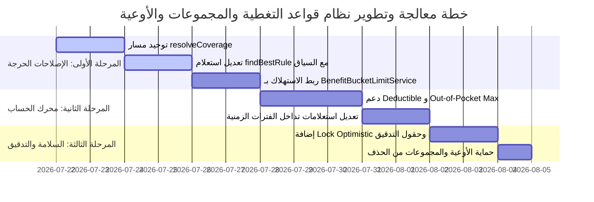

# 🔬 التحليل الهندسي المتقدم والصرامة المعمارية لنظام المنافع والأوعية (Benefit Policy & Buckets Engine)

---

## 🏛️ المقدمة والتأطير الهندسي

بصفتي كبير المهندسين، تم إجراء مراجعة عميقة (Deep Code & Architecture Audit) لكافة مكونات وحدة **Benefit Policy** والمستودعات والخدمات المرتبطة بها في نظام **TBA/WAAD**.

النظام يحوي لبنة معمارية قوية (مثل **Append-only Ledger** مع **Pessimistic Locking**)، إلا أنه يعاني من **انفصامات هندسية (Architectural Dichotomies)** وثغرات متقدمة تؤدي مباشرة إلى **تسرب مالي (Financial Leakage)** و**أخطاء في فحص الأهلية** و**تضارب في الأرصدة المتبقية**.

---

## 🛑 القسم الأول: تشريح الثغرات الحرجة (Critical Vulnerabilities) مع أمثلة الفشل والإصلاح الهندسي

---

### 🚨 الثغرة الحرجة #1: ازدواجية مسارات حل التغطية (Resolution Path Dichotomy)

#### 📝 وصف المشكلة الهندسية:
توجد 3 دوال مستقلة لحل التغطية في [BenefitPolicyCoverageService](file:///d:/tba_waad_system-main_success/tba_waad_system-main/backend/src/main/java/com/waad/tba/modules/benefitpolicy/service/BenefitPolicyCoverageService.java):
1. `getCoverageForService()` (السطر 225)
2. `resolveCoverage()` (السطر 878)
3. `validateServiceCoverageForInput()` (السطر 409)

الفرع الأول يعيد `POLICY_DEFAULT` (مثلاً 80% تغطية) عندما لا توجد قاعدة، بينما الفرعان الثاني والثالث يعيدان `false` (غير مغطى بنسبة 0%)!

#### 💥 مثال واقعي للفشل المالي والعملياتي (Failure Scenario):
1. مريض يتوجه للعيادة لإجراء تحليل **"وظائف كبد"**.
2. موظف الاستقبال يستعلم عبر شاشة الأهلية (التي تستدعي `getCoverageForService()`).
3. النظام يُظهر: **"خدمة مغطاة بنسبة 80% (افتراضي الوثيقة)"**. يتم تقديم الخدمة للمريض.
4. يرسل المزود المطالبة للمراجعة والاعتماد (التي تستدعي `CoverageEngineService` المعتمد على `resolveCoverage()`).
5. المحرك يرفض البند كلياً بـ **"لا توجد قاعدة تغطية فعالة للتصنيف" (تغطية 0%)**.
6. **النتيجة**: خسارة مالية إما للمزود أو نزاع مع المؤمن عليه، ورفض شبحي غير مبرر في المطالبات!

#### 🛠️ الكود المعالج والتصحيح المعماري (Refactoring Code):

```java
// ❌ الكود الخاطئ الحالي في BenefitPolicyCoverageService.java (السطور 225-231):
if (ruleOpt.isEmpty()) {
    return Optional.of(CoverageInfo.builder()
            .covered(true)
            .coveragePercent(policy.getDefaultCoveragePercent()) // ❌ يرجع 80%
            .ruleType("POLICY_DEFAULT")
            .build());
}

// ✅ الكود المصحح الموحد (Unified Resolution Pipeline):
@Transactional(readOnly = true)
public Optional<CoverageInfo> getCoverageForService(Member member, Long serviceId, Long categoryOverrideId, EncounterType encounterType) {
    BenefitPolicy policy = member.getBenefitPolicy();
    if (policy == null || serviceId == null) {
        return Optional.empty();
    }

    MedicalService service = serviceRepository.findById(serviceId).orElse(null);
    if (service == null) {
        return Optional.empty();
    }

    Long categoryId = (categoryOverrideId != null) ? categoryOverrideId : service.getCategoryId();
    
    // ✅ تفويض كامل وحصري للمحرك الموحد canonical resolveCoverage
    ResolvedCoverage resolved = resolveCoverage(
            policy.getId(), 
            serviceId, 
            categoryId, 
            categoryOverrideId, 
            member.getId(), 
            LocalDate.now(), 
            null, 
            CategoryContext.valueOf(encounterType.name()), 
            1.0, 
            null, 
            true
    );

    if (!resolved.isCovered()) {
        return Optional.empty(); // ✅ اتساق تام بين الأهلية والمطالبات
    }

    return Optional.of(CoverageInfo.builder()
            .covered(true)
            .coveragePercent(resolved.getCoveragePercent())
            .amountLimit(resolved.getAmountLimit())
            .timesLimit(resolved.getTimesLimit())
            .requiresPreApproval(resolved.isRequiresPreApproval())
            .waitingPeriodDays(resolved.getWaitingPeriodDays())
            .ruleId(resolved.getRuleId())
            .ruleType(resolved.getSource().name())
            .serviceName(service.getName())
            .build());
}
```

---

### 🚨 الثغرة الحرجة #2: استعلام `findBestRuleForService` يتجاهل سياق الزيارة (`EncounterType`)

#### 📝 وصف المشكلة الهندسية:
في [BenefitPolicyRuleRepository.java](file:///d:/tba_waad_system-main_success/tba_waad_system-main/backend/src/main/java/com/waad/tba/modules/benefitpolicy/repository/BenefitPolicyRuleRepository.java#L149-L177)، يُستخدم استعلام `findBestRuleForService` في عدة خدمات مركزية دون تصفية بحقل `encounter_type`.

#### 💥 مثال واقعي للفشل المالي (Failure Scenario):
- وثيقة التغطية تنص على:
  - تصنيف **"الأشعة التشخيصية"** في العيادات الخارجية (`OUTPATIENT`): تغطية **70%**.
  - تصنيف **"الأشعة التشخيصية"** في إيواء المرضى (`INPATIENT`): تغطية **100%**.
- مريض مُنوّم في المستشفى (`INPATIENT`) أجرى صورة أشعة بقيمة **1,000 د.ل**.
- النظام يستدعي `getCoverageForService()` أو `validateServiceCoverageForInput()`.
- الاستعلام يجلب أول قاعدة صادفة بالترتيب الرقمي دون فحص `encounterType` فترجع قاعدة `OUTPATIENT` (70%).
- **الفشل المالي**: خصم **300 د.ل** من المريض بالخطأ بدلاً من تغطية العمل بالكامل (100%).

#### 🛠️ الكود المعالج والتصحيح المعماري (Refactoring Code):

```sql
-- ❌ الاستعلام الحالي الخاطئ في BenefitPolicyRuleRepository.java:
@Query("""
    SELECT r FROM BenefitPolicyRule r
    WHERE r.benefitPolicy.id = :policyId
      AND r.active = true AND r.deleted = false
      AND (
        (:overrideCategoryId IS NOT NULL AND r.medicalCategory.id = :overrideCategoryId)
        OR (:serviceCategoryId IS NOT NULL AND r.medicalCategory.id = :serviceCategoryId)
      )
    ORDER BY r.id ASC
    LIMIT 1
    """)
Optional<BenefitPolicyRule> findBestRuleForService(...);

-- ✅ الاستعلام المحسن والصارم المقيد بالسياق (Strict Context-Aware Match):
@Query("""
    SELECT r FROM BenefitPolicyRule r
    WHERE r.benefitPolicy.id = :policyId
      AND r.active = true 
      AND r.deleted = false
      AND (r.encounterType = :encounterType OR r.encounterType = com.waad.tba.modules.providercontract.enums.EncounterType.ANY)
      AND (
        (:overrideCategoryId IS NOT NULL AND r.medicalCategory.id = :overrideCategoryId)
        OR (:serviceCategoryId IS NOT NULL AND r.medicalCategory.id = :serviceCategoryId)
        OR (:parentCategoryId IS NOT NULL AND r.medicalCategory.id = :parentCategoryId AND r.inheritanceEnabled = true)
      )
    ORDER BY
      CASE WHEN r.encounterType = :encounterType THEN 0 ELSE 1 END,
      CASE WHEN :overrideCategoryId IS NOT NULL AND r.medicalCategory.id = :overrideCategoryId THEN 0
           WHEN :serviceCategoryId IS NOT NULL AND r.medicalCategory.id = :serviceCategoryId THEN 1
           ELSE 2 END,
      r.priority ASC,
      r.id ASC
    LIMIT 1
    """)
Optional<BenefitPolicyRule> findBestRuleForServiceAndContext(
    @Param("policyId") Long policyId,
    @Param("serviceCategoryId") Long serviceCategoryId,
    @Param("overrideCategoryId") Long overrideCategoryId,
    @Param("parentCategoryId") Long parentCategoryId,
    @Param("encounterType") EncounterType encounterType);
```

---

### 🚨 الثغرة الحرجة #3: تضارب حساب الاستهلاك (Consumption Calculation Discrepancy)

#### 📝 وصف المشكلة الهندسية:
هناك آليتان متوازيتان لحساب استهلاك السقف المالي:
1. **الآلية القديمة**: `BenefitPolicyRuleService.checkUsageLimit()` تجمع المبالغ مباشرة عبر استعلام JPQL يضرب السعر بالكمية من جدول `ClaimLine`.
2. **الآلية الحديثة**: `BenefitBucketLimitService` و `BenefitBucketLedgerService` تعتمد على جدول دفتر الأوعية `BenefitBucketConsumption`.

#### 💥 مثال واقعي للفشل المالي (Failure Scenario):
1. مريض لديه سقف أسنان قدره **500 د.ل**.
2. قدم مطالبة سابقة بقيمة 400 د.ل وتلقى موافقة وتم تسجيلها في الدفتر (`BenefitBucketConsumption`).
3. تم إلغاء المطالبة أو تسويتها جزئياً وتحديث حالة السطر في `ClaimLine`.
4. عند تقديم مطالبة جديدة بقيمة 200 د.ل:
   - `checkUsageLimit` تقرأ من `ClaimLine` وتراها 300 د.ل مستهلكة (الرصيد المتبقي 200) ← **تسمح بالخدمة**.
   - المحرك المالي عند الاعتماد النهائي `commitClaim` يقرأ من `BenefitBucketConsumption` ويجد المستهلك 400 د.ل (الرصيد المتبقي 100) ← **ترفض الاعتماد بشرارة استثناء `BusinessRuleException`!**
5. **النتيجة**: المطالبة تعبر الشاشات الأولية بنجاح ثم تنهار في خطوة الاعتماد النهائي في التسوية السريعة!

#### 🛠️ الكود المعالج والتصحيح المعماري (Refactoring Code):

```java
// ❌ الكود الحالي في BenefitPolicyRuleService.java (استعلام مباشر ملغى):
String q = "SELECT COUNT(DISTINCT c.id), SUM(cl.approvedUnitPrice * cl.approvedQuantity) " +
           "FROM ClaimLine cl JOIN cl.claim c ...";

// ✅ الإصلاح المعماري الكامل: إلغاء الاستعلام المباشر واعتماد BenefitBucketLimitService
@Transactional(readOnly = true)
public Map<String, Object> checkUsageLimit(Long policyId, Long serviceId, Long categoryId,
        Long serviceCategoryId, Long memberId, Integer year, Long excludeClaimId,
        EncounterType encounterType) {

    Long resolvedCategoryId = serviceCategoryId != null ? serviceCategoryId : categoryId;
    Optional<BenefitPolicyRuleResponseDto> ruleOpt = findCoverageForService(policyId, serviceId,
            resolvedCategoryId, encounterType);
    if (ruleOpt.isEmpty()) {
        return Map.of("covered", false);
    }

    BenefitPolicyRuleResponseDto rule = ruleOpt.get();
    
    // ✅ استدعاء خدمة الأوعية الرسمية المعتمدة على الـ Ledger
    List<LimitSnapshot> limits = benefitBucketLimitService.findApplicable(
            rule.getId(), memberId, LocalDate.of(year != null ? year : LocalDate.now().getYear(), 1, 1), 
            encounterType, excludeClaimId);

    if (limits.isEmpty()) {
        return Map.of("covered", true, "hasLimit", false);
    }

    boolean exceeded = false;
    BigDecimal totalUsedAmount = BigDecimal.ZERO;
    int totalUsedTimes = 0;
    
    for (LimitSnapshot limit : limits) {
        if (limit.amountLimit() != null && limit.usedAmount().compareTo(limit.amountLimit()) >= 0) {
            exceeded = true;
        }
        if (limit.timesLimit() != null && limit.usedTimes() >= limit.timesLimit()) {
            exceeded = true;
        }
        totalUsedAmount = totalUsedAmount.max(limit.usedAmount());
        totalUsedTimes = Math.max(totalUsedTimes, limit.usedTimes());
    }

    Map<String, Object> usageMap = new HashMap<>();
    usageMap.put("covered", true);
    usageMap.put("hasLimit", true);
    usageMap.put("ruleId", rule.getId());
    usageMap.put("usedCount", totalUsedTimes);
    usageMap.put("usedAmount", totalUsedAmount);
    usageMap.put("exceeded", exceeded);
    return usageMap;
}
```

---

## ⚠️ القسم الثاني: النواقص والثغرات المرتفعة والمتوسطة

---

### 1. تجاهل حقول التحمل السنوي والحد الأقصى للمصاريف المباشرة (`Deductible` & `Out-of-Pocket Max`)

#### 📝 المشكلة:
جدول `benefit_policies` يحوي الحقول:
- `annual_deductible`: المبلغ التجميعي الذي يدفعه المريض سنوياً قبل بدء تغطية الشركة.
- `out_of_pocket_max`: الحد الأقصى لما يدفعه المريض (Deductible + Copay)، وبعده تصبح التغطية 100%.

في [CoverageEngineService.java](file:///d:/tba_waad_system-main_success/tba_waad_system-main/backend/src/main/java/com/waad/tba/modules/claim/service/CoverageEngineService.java)، **هذه الحقول معطلة تماماً ولا تدخل في معادلة الحساب!**

#### 💥 مثال الفشل:
وثيقة تحتوي على Deductible سنوي **100 د.ل**. المريض يقدم أول مطالبة بقيمة **80 د.ل** بنسبة تغطية 80%.
- **المطلوب قانوناً**: يدفع المريض 80 د.ل بالكامل لاستيفاء جزء من الـ Deductible.
- **الواقع في المحرك**: المحرك يغطي 80% (64 د.ل) ويدفع المريض 20% (16 د.ل) ← **تسرب مالي من شركه التأمين!**

#### 🛠️ الإصلاح في المحرك المالي `CoverageEngineService.java`:

```java
// ✅ إضافة حساب الـ Deductible والـ OOP Max في تسلسل الحساب:
BigDecimal annualDeductible = policy.getAnnualDeductible();
BigDecimal remainingDeductible = calculateRemainingDeductible(member.getId(), policy, request.getServiceDate());

BigDecimal patientCopay = scale2(allowedGross.multiply(patientRate).divide(HUNDRED, 2, RoundingMode.HALF_UP));

// تطبيق التحمل السنوي أولاً
BigDecimal deductibleApplied = ZERO;
if (remainingDeductible.compareTo(ZERO) > 0) {
    deductibleApplied = allowedGross.min(remainingDeductible);
}

BigDecimal grossAfterDeductible = allowedGross.subtract(deductibleApplied);
patientCopay = scale2(grossAfterDeductible.multiply(patientRate).divide(HUNDRED, 2, RoundingMode.HALF_UP));

BigDecimal totalPatientShare = deductibleApplied.add(patientCopay);

// فحص Out-of-Pocket Max
BigDecimal oopMax = policy.getOutOfPocketMax();
if (oopMax != null && oopMax.compareTo(ZERO) > 0) {
    BigDecimal usedOOP = calculateUsedOutOfPocket(member.getId(), policy, request.getServiceDate().getYear());
    BigDecimal oopCapRemaining = oopMax.subtract(usedOOP).max(ZERO);
    totalPatientShare = totalPatientShare.min(oopCapRemaining);
}

BigDecimal companyShare = maxZero(allowedGross.subtract(totalPatientShare));
```

---

### 2. مطابقة تامة للفترة في مستودع الاستهلاك تعطل السقوف عند تمديد الوثيقة

#### 📝 المشكلة:
في [BenefitBucketConsumptionRepository.java](file:///d:/tba_waad_system-main_success/tba_waad_system-main/backend/src/main/java/com/waad/tba/modules/benefitpolicy/repository/BenefitBucketConsumptionRepository.java#L44-L67)، يتم الاستعلام بشرط:
```sql
WHERE c.periodStart = :periodStart AND c.periodEnd = :periodEnd
```

#### 💥 مثال الفشل:
- وثيقة تم تمديدها بملحق من `2026-12-31` إلى `2027-03-31`.
- المطالبات القديمة سجلت استهلاكاً بـ `periodEnd = 2026-12-31`.
- المطالبات الجديدة تحسب `periodEnd = 2027-03-31`.
- عند تجميع الاستهلاك لوعاء سنوي، الاستعلام يتجاهل جميع المطالبات السابقة لاختلاف `periodEnd` ← **تصفير تجميعي غير قانوني للأرصدة!**

#### 🛠️ الإصلاح (Range Intersect Query):

```sql
-- ✅ تجميع قائم على تداخل الفترات الزمنية بدلاً من التطابق التام:
@Query("""
    select coalesce(sum(c.approvedAmount), 0) from BenefitBucketConsumption c
    where c.memberId = :memberId 
      and c.bucket.id = :bucketId 
      and c.status = com.waad.tba.modules.benefitpolicy.entity.BenefitBucketConsumption.Status.COMMITTED
      and (c.periodStart <= :serviceDate and (c.periodEnd is null or c.periodEnd >= :serviceDate))
      and (:excludeClaimId is null or c.claim.id <> :excludeClaimId)
    """)
BigDecimal sumCommittedAmountForDate(@Param("memberId") Long memberId,
                                     @Param("bucketId") Long bucketId,
                                     @Param("serviceDate") LocalDate serviceDate,
                                     @Param("excludeClaimId") Long excludeClaimId);
```

---

### 3. خطر فقدان التحديثات المتزامنة (Lost Updates) وغياب تدقيق التعديلات

#### 📝 المشكلة:
الكيانات الحاكمة للعملية الحسابية `BenefitPolicy` و `BenefitPolicyRule` **تفتقر لـ `@Version`** ولحقول التدقيق المتقدمة (`createdBy`, `modifiedBy`).

#### 💥 مثال الفشل:
- مدير النظام A يفتح وثيقة لرفع التغطية من 80% إلى 90%.
- مدير النظام B يفتح نفس الوثيقة لتعديل السقف السنوي.
- B يحفظ التغيير (السقف السنوي الجديد).
- A يحفظ التغيير (التغطية 90%) بعد B بثوانٍ ← كود A يمسح التحديث الذي أجراه B بدون علم النظام!

#### 🛠️ الإصلاح:

```java
// ✅ إضافة القفل التفاؤلي وتدقيق المستخدمين على الكيانات:
@Entity
@Table(name = "benefit_policies")
public class BenefitPolicy {
    // ...
    @Version
    private Long version;

    @CreatedBy
    @Column(name = "created_by", updatable = false)
    private String createdBy;

    @LastModifiedBy
    @Column(name = "last_modified_by")
    private String lastModifiedBy;
}
```

---

## 📐 القسم الثالث: مصفوفة السيناريوهات وفحص الحالات الإدية (Edge Cases Matrix)

| السيناريو | الحالة الراهنة | النتيجة بعد التعديل الهندسي المقترح |
| :--- | :--- | :--- |
| **تعدد البنود في مطالبات المعامل دفعة واحدة** | ⚠️ قد تتجاوز السقف في البند الأخير إذا لم تتراكم في memory | ✅ تراكم دقيق عبر `BatchUsageAccumulator` داخل الدفعة |
| **إلغاء مطالبة معتمدة (Reversal)** | ✅ تعكس الاستهلاك برسالة `REVERSED` | ✅ مستقرة وآمنة معماريًا |
| **إدخال مطالبة بتاريخ قديم (Backlog)** | ⚠️ تمر عبر Staff Bypass لكن قد تصطدم بسقف منتهي | ✅ إعادة احتساب الفترة الزمنية بناءً على تاريخ الخدمة |
| **حذف وعاء سقف مالي له استهلاكات** | ❌ يمر ويترك أيتاماً في قاعدة البيانات `orphan consumptions` | 🛑 منع الحذف بشرط وجود سجلات `COMMITTED` |
| **تأمين الأقارب (Dependent Members)** | ⚠️ حد العائلة يفحص بالاسم فقط دون ربط كامل بالأوعية | ✅ دمج `perFamilyLimit` داخل أوعية `BenefitLimitBucket` |

---

## 🎯 الخطة التنفيذية والتوصيات ذات الأولوية



1. **الخطوة الأولى (فورية)**: تطبيق التعديل على `BenefitPolicyCoverageService` لإلغاء الازدواجية وإجبار كافة الاستعلامات على المرور عبر `resolveCoverage` الصارم مع تحديد `EncounterType`.
2. **الخطوة الثانية**: تعديل استعلامات `BenefitBucketConsumptionRepository` لتعتمد تداخل النطاق الزمني بدلاً من المطابقة التامة.
3. **الخطوة الثالثة**: إدخال حساب الـ Deductible و Copay المعطلين في `CoverageEngineService` لغلق ملف التسرب المالي.
