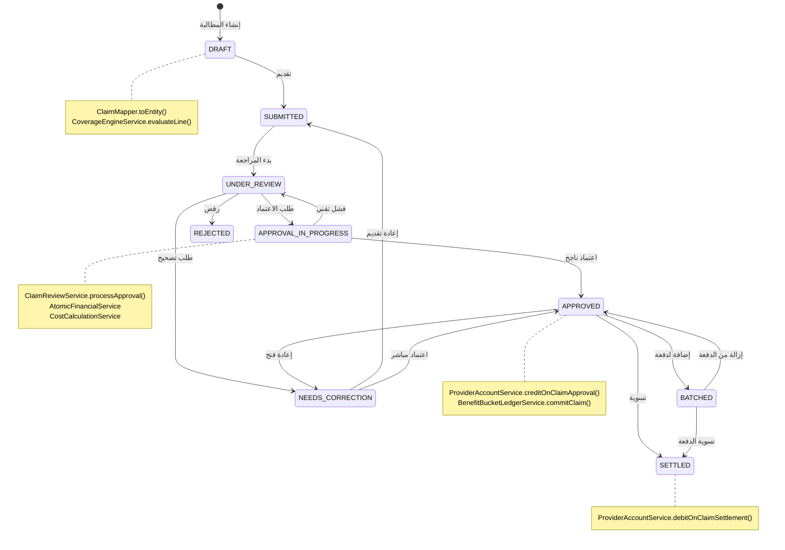
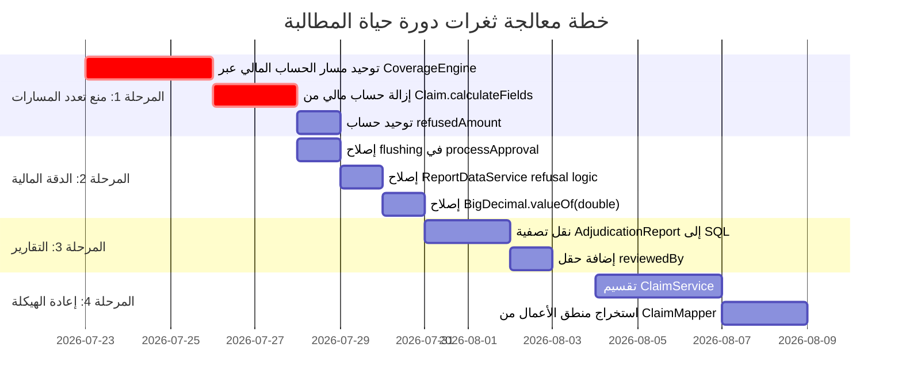

# 🔬 تحليل دورة حياة المطالبة الكامل — من الإنشاء إلى التقارير الحسابية

---

## 📋 الفهرس التنفيذي

| البُعد | عدد الثغرات | الحرج | المرتفع | المتوسط |
|:---|:---:|:---:|:---:|:---:|
| تعدد المسارات في الكود | 4 | 🔴 2 | 🟠 2 | — |
| الدقة المالية | 3 | 🔴 1 | 🟠 2 | — |
| التكامل مع العقود والوثائق | 2 | — | 🟠 1 | 🟡 1 |
| التقارير الحسابية | 3 | 🔴 1 | 🟠 1 | 🟡 1 |
| تقارير المراجعين | 2 | — | 🟠 1 | 🟡 1 |
| تجربة المستخدم | 3 | — | 🟠 2 | 🟡 1 |
| الديون التقنية | 4 | — | 🟠 2 | 🟡 2 |
| **المجموع** | **21** | **4** | **11** | **6** |

---

## 🏛️ القسم الأول: دورة الحياة الكاملة (Lifecycle Anatomy)



### المكونات المشاركة في كل مرحلة

| المرحلة | الملفات المشاركة | العملية المالية |
|:---|:---|:---|
| **الإنشاء (DRAFT)** | [ClaimMapper](file:///d:/tba_waad_system-main_success/tba_waad_system-main/backend/src/main/java/com/waad/tba/modules/claim/mapper/ClaimMapper.java) → [CoverageEngineService](file:///d:/tba_waad_system-main_success/tba_waad_system-main/backend/src/main/java/com/waad/tba/modules/claim/service/CoverageEngineService.java) → [CoverageDecisionService](file:///d:/tba_waad_system-main_success/tba_waad_system-main/backend/src/main/java/com/waad/tba/modules/benefitpolicy/service/CoverageDecisionService.java) | حساب التغطية، فارق السعر، السقف |
| **التقديم (SUBMITTED)** | [ClaimStateMachine](file:///d:/tba_waad_system-main_success/tba_waad_system-main/backend/src/main/java/com/waad/tba/modules/claim/service/ClaimStateMachine.java) | تعيين SLA |
| **المراجعة (UNDER_REVIEW)** | [ClaimReviewService](file:///d:/tba_waad_system-main_success/tba_waad_system-main/backend/src/main/java/com/waad/tba/modules/claim/service/ClaimReviewService.java) + [ReviewerProviderIsolationService](file:///d:/tba_waad_system-main_success/tba_waad_system-main/backend/src/main/java/com/waad/tba/modules/claim/service/ReviewerProviderIsolationService.java) | تعليق/استئناف |
| **الاعتماد (APPROVED)** | [AtomicFinancialService](file:///d:/tba_waad_system-main_success/tba_waad_system-main/backend/src/main/java/com/waad/tba/modules/claim/service/AtomicFinancialService.java) → [CostCalculationService](file:///d:/tba_waad_system-main_success/tba_waad_system-main/backend/src/main/java/com/waad/tba/modules/claim/service/CostCalculationService.java) | Co-Pay + Deductible + Credit حساب المزود |
| **التسوية (SETTLED)** | [ProviderAccountService](file:///d:/tba_waad_system-main_success/tba_waad_system-main/backend/src/main/java/com/waad/tba/modules/settlement/service/ProviderAccountService.java) | Debit حساب المزود |
| **التقارير** | [ClaimFinancialSummaryService](file:///d:/tba_waad_system-main_success/tba_waad_system-main/backend/src/main/java/com/waad/tba/modules/claim/service/ClaimFinancialSummaryService.java) + [AdjudicationReportService](file:///d:/tba_waad_system-main_success/tba_waad_system-main/backend/src/main/java/com/waad/tba/modules/claim/service/AdjudicationReportService.java) + [ReportDataService](file:///d:/tba_waad_system-main_success/tba_waad_system-main/backend/src/main/java/com/waad/tba/modules/report/service/ReportDataService.java) + [FinancialConsolidationService](file:///d:/tba_waad_system-main_success/tba_waad_system-main/backend/src/main/java/com/waad/tba/modules/report/service/FinancialConsolidationService.java) | تجميعات مالية |

---

## 🚨 القسم الثاني: تعدد المسارات في الكود لنفس المهمة (Path Duplication Analysis)

> [!CAUTION]
> هذا هو أخطر نوع من الديون التقنية — عندما يوجد أكثر من مسار واحد لحساب نفس الرقم المالي، يصبح التضارب حتمياً لا احتمالياً.

---

### 🔴 الازدواجية #1: مساران لحساب Co-Pay / NetProviderAmount عند الاعتماد

#### المسار A: الإدخال المباشر (Direct Entry Path)
```
ClaimMapper.processEngineCalculations()
  → CoverageEngineService.evaluateLine()  ← حساب line-level
  → ClaimMapper.calculateClaimTotals()     ← تجميع claim-level
    → claim.setNetProviderAmount(totalApproved)
    → claim.setPatientCoPay(totalPatientShare)
```

#### المسار B: مسار المراجعة (Review Approval Path)
```
ClaimReviewService.processApproval()
  → AtomicFinancialService.calculateCostsWithAtomicDeductible()
    → CostCalculationService.calculateCosts()    ← حساب مختلف تماماً!
  → يحسب netProviderAmount يدوياً بمعادلة مختلفة
    → claim.setNetProviderAmount(netProviderAmount)
    → claim.setPatientCoPay(patientCoPay)
```

#### 💥 مثال الفشل:

**سيناريو**: مطالبة بخطين: أشعة (تغطية 80%) وأسنان (تغطية 50%)
- خصم تعاقدي: 10% (mode: BEFORE rejection)
- الخط الأول: أشعة 200 د.ل (أُدخل بسعر أعلى من العقد: 250 د.ل)
- الخط الثاني: أسنان 100 د.ل (سعر تعاقدي مطابق)

**المسار A** (ClaimMapper — عند الإنشاء):
```
الخط 1: effectiveTotal=200, patientShare=200×20%=40, providerShare=160
         discount=160×10%=16, rejected=0 → finalPayable=144
الخط 2: effectiveTotal=100, patientShare=100×50%=50, providerShare=50
         discount=50×10%=5, rejected=0 → finalPayable=45
─────────────────────────────────────────────────
المجموع: totalPatientShare=90, totalRefused=50(priceExcess), 
         netProviderAmount=189 (بعد حساب claimTotals بخصم 10%)
```

**المسار B** (ClaimReviewService — عند الاعتماد):
```
CostCalculationService: weightedCopay=30% (وزني)
  deductible=0, copayAmount=300×30%=90, insuranceAmount=210
processApproval: requestedAmount=300, refusedAmount=50
  netAccepted=250, systemPatientCoPay=90
  → patientCoPay=90, systemNetProvider=160
  → يعيد حساب الخصم: providerShare=300-90=210
    BEFORE mode: discount=210×10%=21, net=210-21-50=139
  → netProviderAmount=139 ≠ 189 ❌
```

> [!IMPORTANT]
> **الفرق**: 189 vs 139 = **50 د.ل** اختلاف مالي على مطالبة واحدة! لأن المسارين يحسبان الـ `providerShare` بمرجعيات مختلفة.

#### 🛠️ الإصلاح: مسار واحد حصري

```java
// ✅ يجب أن يعتمد ClaimReviewService.processApproval على CoverageEngineService
// بنفس الطريقة التي يعمل بها ClaimMapper — لا على CostCalculationService
@Transactional(propagation = Propagation.REQUIRES_NEW, isolation = Isolation.SERIALIZABLE)
public void processApproval(Long id, ClaimApproveDto dto, Long actorId, ...) {
    Claim claim = claimRepository.findByIdForFinancialUpdate(id).orElseThrow(...);
    
    // ✅ إعادة حساب عبر نفس المسار الذي يمر به الإنشاء
    // بدلاً من استدعاء CostCalculationService المستقل
    claimMapper.recalculateEngineResults(claim);
    
    // الآن claim.netProviderAmount و claim.patientCoPay 
    // محسوبان بنفس المسار الوحيد: CoverageEngineService → calculateClaimTotals
    
    BigDecimal approvedAmount = claim.getNetProviderAmount();
    // ... باقي منطق الاعتماد
}
```

---

### 🔴 الازدواجية #2: ثلاثة مسارات لحساب `refusedAmount`

| المسار | الملف | المعادلة |
|:---|:---|:---|
| **A** | [Claim.java](file:///d:/tba_waad_system-main_success/tba_waad_system-main/backend/src/main/java/com/waad/tba/modules/claim/entity/Claim.java#L524-L526) `calculateFields()` | `SUM(line.refusedAmount)` |
| **B** | [ClaimMapper](file:///d:/tba_waad_system-main_success/tba_waad_system-main/backend/src/main/java/com/waad/tba/modules/claim/mapper/ClaimMapper.java#L418-L420) `calculateClaimTotals()` | `SUM(line.refusedAmount)` |
| **C** | [ClaimReviewService](file:///d:/tba_waad_system-main_success/tba_waad_system-main/backend/src/main/java/com/waad/tba/modules/claim/service/ClaimReviewService.java#L365) `processApproval()` | `claim.getRefusedAmount()` (الحقل المخزن) |

#### 💥 مثال الفشل:
1. المطالبة تُنشأ عبر ClaimMapper → `refusedAmount = 50` (SUM of line-level refusals).
2. المراجع يرفض بنداً يدوياً (line.rejected = true).
3. `Claim.calculateFields()` يُعاد تشغيلها في `@PreUpdate` → تعيد حساب `refusedAmount` من البنود (الآن 150).
4. لكن `processApproval()` قرأ `claim.getRefusedAmount()` = **50** (القيمة القديمة) قبل أن يُشغِّل JPA الـ `@PreUpdate`.
5. **النتيجة**: المراجع يرى `refusedAmount=50` بينما الحقيقة `refusedAmount=150` → خطأ بقيمة **100 د.ل** في `netProviderAmount`.

#### 🛠️ الإصلاح:

```java
// ✅ في processApproval() — إجبار إعادة الحساب قبل القراءة
em.flush(); // يفرض تشغيل @PreUpdate
em.refresh(claim); // يعيد قراءة الحقول المحسوبة
BigDecimal refusedAmount = claim.getRefusedAmount(); // الآن دقيقة
```

---

### 🟠 الازدواجية #3: مساران لحساب `discountAmount`

| المسار | الملف | المعادلة |
|:---|:---|:---|
| **A** | [ClaimMapper.calculateClaimTotals()](file:///d:/tba_waad_system-main_success/tba_waad_system-main/backend/src/main/java/com/waad/tba/modules/claim/mapper/ClaimMapper.java#L413-L444) | `providerShare × discountRate / 100` (claim-level) |
| **B** | [Claim.calculateFields()](file:///d:/tba_waad_system-main_success/tba_waad_system-main/backend/src/main/java/com/waad/tba/modules/claim/entity/Claim.java#L566-L592) | نفس المعادلة تماماً لكن كتكرار مستقل |

```java
// ❌ في Claim.calculateFields() (السطور 566-591)
BigDecimal providerShare = scale2(gross.subtract(patient));
BigDecimal discount = scale2(providerShare.multiply(discountRate)
        .divide(new BigDecimal("100"), 2, RoundingMode.HALF_UP));
this.companyDiscountAmount = discount;

// ❌ في ClaimMapper.calculateClaimTotals() (السطور 429-443)
BigDecimal providerShare = scale2(totalRequested.subtract(totalPatientShare));
BigDecimal discount = scale2(providerShare.multiply(discountRate)
        .divide(HUNDRED, 2, RoundingMode.HALF_UP));
```

> [!WARNING]
> **نتيجة التكرار**: `ClaimMapper` تحسب الخصم من `totalRequested - totalPatientShare` (المجموع)، ثم `Claim.calculateFields()` تعيد حسابها في `@PrePersist/@PreUpdate` من **نفس الحقول ولكن بعد أي تعديلات** ← قد يقع تضارب في حالات الـ round-up.

#### 🛠️ الإصلاح:

```java
// ✅ Claim.calculateFields() يجب أن تتجاوز الحساب إذا كانت 
// القيم قد تم ضبطها مسبقاً من ClaimMapper أو ClaimReviewService
private void calculateFields() {
    if (lines != null && !lines.isEmpty()) {
        this.requestedAmount = lines.stream()...;
        this.refusedAmount = lines.stream()...;
    }
    
    // ✅ لا تعيد حساب netProviderAmount/patientCoPay إذا كانت موجودة ومتسقة
    boolean financialsPreSet = this.netProviderAmount != null 
        && this.patientCoPay != null 
        && (status == ClaimStatus.APPROVED || status == ClaimStatus.SETTLED);
    if (financialsPreSet) {
        // فقط تحقق المعادلة المالية دون إعادة الحساب
        validateFinancialIdentity();
        return;
    }
    // ... الحساب الافتراضي للمسودات فقط
}
```

---

### 🟠 الازدواجية #4: مساران لحساب `outstanding` في التقارير

| المسار | الملف | المعادلة |
|:---|:---|:---|
| **A** | [ClaimFinancialSummaryService](file:///d:/tba_waad_system-main_success/tba_waad_system-main/backend/src/main/java/com/waad/tba/modules/claim/service/ClaimFinancialSummaryService.java#L122) | `totalNetProvider - totalSettled` (من SUM SQL) |
| **B** | [ProviderAccountService](file:///d:/tba_waad_system-main_success/tba_waad_system-main/backend/src/main/java/com/waad/tba/modules/settlement/service/ProviderAccountService.java#L77-L78) | `totalApproved - totalPaid` (من حقول `ProviderAccount`) |

```
ClaimFinancialSummaryService: SUM(netProviderAmount WHERE status IN APPROVED,SETTLED) - SUM(paidAmount WHERE status=SETTLED)
ProviderAccountService: account.totalApproved - account.totalPaid
```

> [!NOTE]
> إذا فشل `creditOnClaimApproval()` بعد حفظ المطالبة بنجاح (عبر REQUIRES_NEW)، تصبح المطالبة APPROVED لكن `ProviderAccount.totalApproved` لم يتحدث ← **outstanding** يختلف بين التقريرين.

---

## 🧮 القسم الثالث: الدقة المالية وتحليل الأخطاء الحسابية

---

### 🔴 الثغرة #1: `Claim.calculateFields()` في `@PreUpdate` يدهس حقول ClaimReviewService

في [Claim.java السطر 431-436](file:///d:/tba_waad_system-main_success/tba_waad_system-main/backend/src/main/java/com/waad/tba/modules/claim/entity/Claim.java#L431-L436)، كل `claimRepository.save(claim)` يُشغِّل `@PreUpdate` → `calculateFields()` → يعيد حساب `approvedAmount` و `netProviderAmount` من البنود حتى لو كانت `processApproval()` قد ضبطتها للتو.

#### 💥 سيناريو الفشل:
1. `processApproval()` يحسب `netProviderAmount = 500`.
2. يستدعي `claim.setNetProviderAmount(500)`.
3. يستدعي `claimRepository.save(claim)`.
4. JPA تُشغِّل `@PreUpdate` → `calculateFields()` → تعيد حساب `netProviderAmount` من البنود = **480** (فرق تقريب).
5. `validateFinancialIdentity()` تقارن 480 vs 500 → **FAIL** → `IllegalStateException` → Transaction rollback!

#### 🛠️ الإصلاح:

```java
// ✅ في Claim.calculateFields()، إضافة حارس:
private void calculateFields() {
    if (lines != null && !lines.isEmpty()) {
        this.requestedAmount = lines.stream()...;
        this.refusedAmount = lines.stream()...;
    }
    
    // ✅ Guard: لا تعيد حساب الأرقام المالية النهائية
    // إذا كانت الحالة APPROVED أو SETTLED أو APPROVAL_IN_PROGRESS
    boolean financiallyFrozen = status == ClaimStatus.APPROVED 
        || status == ClaimStatus.SETTLED 
        || status == ClaimStatus.APPROVAL_IN_PROGRESS;
    
    if (financiallyFrozen && this.netProviderAmount != null) {
        // القيم ضبطتها الخدمة المالية المختصة — لا ندهسها
        return;
    }
    // ... الحساب الافتراضي للمسودات
}
```

---

### 🟠 الثغرة #2: `CostCalculationService` يتجاهل خصم العقد التعاقدي

[CostCalculationService](file:///d:/tba_waad_system-main_success/tba_waad_system-main/backend/src/main/java/com/waad/tba/modules/claim/service/CostCalculationService.java) يحسب `insuranceAmount` و `patientResponsibility` **بدون أي اعتبار لنسبة خصم العقد** (`appliedDiscountPercent`). ثم `processApproval()` يعيد تطبيق الخصم يدوياً بعد استلام النتائج.

**المشكلة**: `processApproval()` يحسب `patientCoPay` من `CostCalculationService` (بدون خصم)، ثم يحسب `netProviderAmount` مع الخصم. المعادلة المالية:

```
requestedAmount ≠ patientCoPay + netProviderAmount + refusedAmount + companyDiscountAmount
```

لأن `patientCoPay` محسوب على أساس مبلغ بدون خصم و`netProviderAmount` محسوب على أساس مبلغ بخصم.

---

### 🟠 الثغرة #3: `ReportDataService` يحسب المرفوض بمنطق مختلف عن `Claim.entity`

في [ReportDataService.java السطور 112-124](file:///d:/tba_waad_system-main_success/tba_waad_system-main/backend/src/main/java/com/waad/tba/modules/report/service/ReportDataService.java#L112-L124):

```java
if (Boolean.TRUE.equals(line.getRejected()) || claimIsRejected) {
    rejected = gross; // ← المرفوض = كامل المبلغ الإجمالي
}
```

لكن في [Claim.calculateFields()](file:///d:/tba_waad_system-main_success/tba_waad_system-main/backend/src/main/java/com/waad/tba/modules/claim/entity/Claim.java#L524-L526):
```java
this.refusedAmount = lines.stream()
    .map(line -> line.getRefusedAmount() != null ? line.getRefusedAmount() : BigDecimal.ZERO)
    .reduce(BigDecimal.ZERO, BigDecimal::add);
```

**الفرق**: التقرير يعتبر البند المرفوض = `gross` (المبلغ الإجمالي شاملاً فارق السعر)، بينما الكيان يعتبره = `line.refusedAmount` (المبلغ المالي الفعلي = `providerShare` فقط). هذا يخلق **تضخم مالي في التقارير**.

---

## 📊 القسم الرابع: تحليل التقارير الحسابية وتقارير المراجعين

---

### 🔴 التقارير: `AdjudicationReportService` يحمّل كل المطالبات ثم يصفيها في الذاكرة

في [AdjudicationReportService.java السطر 64](file:///d:/tba_waad_system-main_success/tba_waad_system-main/backend/src/main/java/com/waad/tba/modules/claim/service/AdjudicationReportService.java#L64):

```java
List<Claim> allClaims = claimRepository.findByStatusIn(statuses, null).getContent();
```

ثم يصفيها في الذاكرة بالتاريخ والمزود:
```java
List<Claim> claims = allClaims.stream()
    .filter(c -> !c.getServiceDate().isBefore(fromDate))
    .filter(c -> !c.getServiceDate().isAfter(toDate))
    ...
```

#### 💥 مثال الفشل:
- 50,000 مطالبة معتمدة/مسوّاة في قاعدة البيانات.
- التقرير يحتاج فقط 200 مطالبة لشهر واحد.
- النظام يحمّل **جميع الـ 50,000** في الذاكرة، يصفيها → **OutOfMemoryError** في الإنتاج!

#### 🛠️ الإصلاح:

```java
// ✅ نقل التصفية إلى قاعدة البيانات
@Query("""
    SELECT c FROM Claim c WHERE c.status IN :statuses 
    AND c.active = true
    AND c.serviceDate BETWEEN :fromDate AND :toDate
    AND (:providerName IS NULL OR LOWER(c.providerName) LIKE LOWER(CONCAT('%',:providerName,'%')))
    """)
List<Claim> findForAdjudicationReport(
    @Param("statuses") List<ClaimStatus> statuses,
    @Param("fromDate") LocalDate fromDate,
    @Param("toDate") LocalDate toDate,
    @Param("providerName") String providerName);
```

---

### 🟠 التقارير: `FinancialConsolidationService` يستخدم BigDecimal.valueOf(double) — فقدان الدقة

في [FinancialConsolidationService.java السطر 50](file:///d:/tba_waad_system-main_success/tba_waad_system-main/backend/src/main/java/com/waad/tba/modules/report/service/FinancialConsolidationService.java#L50):

```java
BigDecimal requested = row[2] != null 
    ? BigDecimal.valueOf(((Number) row[2]).doubleValue()) // ❌ فقدان الدقة!
    : BigDecimal.ZERO;
```

`BigDecimal.valueOf(double)` يفقد الدقة عند المبالغ الكبيرة. الأرقام المالية **يجب** أن تبقى `BigDecimal` من المصدر.

#### 🛠️ الإصلاح:

```java
BigDecimal requested = row[2] instanceof BigDecimal bd ? bd
    : (row[2] != null ? new BigDecimal(row[2].toString()) : BigDecimal.ZERO);
```

---

### 🟡 تقارير المراجعين: لا يوجد تقرير أداء المراجع (Reviewer Performance Report)

النظام يسجل `reviewedAt` و `actualCompletionDate` و `businessDaysTaken` لكن:
- لا يوجد حقل `reviewedBy` على الكيان!
- لا يمكن ربط المطالبة بالمراجع المختص لتقرير أدائه.

#### 🛠️ الإصلاح:

```java
// ✅ إضافة على Claim.java:
@Column(name = "reviewed_by", length = 255)
private String reviewedBy;

@Column(name = "reviewer_id")
private Long reviewerId;
```

---

## 🔗 القسم الخامس: التكامل مع العقود والوثائق

---

### 🟠 غياب تتبع التغييرات في العقد بعد إنشاء المطالبة

عند إنشاء المطالبة، يتم حل السعر التعاقدي ونسبة الخصم مرة واحدة في `ClaimMapper`. لكن إذا تغير العقد (تجديد بأسعار مختلفة) بين الإنشاء والاعتماد:

- `processApproval()` يعيد قراءة `claim.getAppliedDiscountPercent()` — هذا snapshot ✅
- لكن `CostCalculationService` يستدعي `ProviderNetworkService.determineNetworkTypeByName()` لحظياً ← قد يعطي `NetworkType` مختلف إذا تغيرت شبكة المزود!

#### 🛠️ الإصلاح:

```java
// ✅ تخزين لقطة NetworkType في Claim أثناء الإنشاء
@Column(name = "applied_network_type", length = 20)
@Enumerated(EnumType.STRING)
private NetworkType appliedNetworkType;
```

---

### 🟡 لا يوجد تحقق من صلاحية الوثيقة عند الاعتماد

`ClaimReviewService.processApproval()` يتحقق من `benefitPolicyCoverageService.validateAmountLimits()` لكن **لا يتحقق من أن الوثيقة لا تزال فعالة** (`effectiveTo >= serviceDate`). إذا انتهت صلاحية الوثيقة بين الإنشاء والاعتماد، يتم اعتماد مطالبة بوثيقة منتهية.

---

## 🎨 القسم السادس: تجربة المستخدم

---

### 🟠 حالة `APPROVAL_IN_PROGRESS` غير قابلة للاسترداد يدوياً

إذا فشل `processApproval()` مع خطأ غير متوقع (مثلاً deadlock)، يتم استدعاء `revertToUnderReview()` في [ClaimReviewService.java السطر 498-509](file:///d:/tba_waad_system-main_success/tba_waad_system-main/backend/src/main/java/com/waad/tba/modules/claim/service/ClaimReviewService.java#L498-L509):

```java
private void revertToUnderReview(Long id, String errorMessage) {
    try {
        Claim failedClaim = claimRepository.findById(id).orElse(null);
        if (failedClaim != null && failedClaim.getStatus() == ClaimStatus.APPROVAL_IN_PROGRESS) {
            failedClaim.setStatus(ClaimStatus.UNDER_REVIEW); // ❌ يتجاوز StateMachine!
            claimRepository.save(failedClaim);
        }
    } catch (Exception ignore) { } // ❌ يبتلع كل الأخطاء!
}
```

> [!WARNING]
> - يتجاوز `ClaimStateMachine` مباشرةً ← لا يوجد تدقيق (audit) للتراجع.
> - إذا فشل الـ `revert` نفسه، المطالبة تعلق في `APPROVAL_IN_PROGRESS` بدون طريقة تلقائية لاستردادها.

#### 🛠️ الإصلاح:

```java
// ✅ إضافة Scheduled Job لكشف المطالبات العالقة
@Scheduled(fixedDelay = 300_000) // كل 5 دقائق
public void recoverStuckApprovals() {
    LocalDateTime threshold = LocalDateTime.now().minusMinutes(10);
    List<Claim> stuck = claimRepository.findByStatusAndUpdatedAtBefore(
        ClaimStatus.APPROVAL_IN_PROGRESS, threshold);
    
    for (Claim claim : stuck) {
        log.warn("🔧 Recovering stuck claim {} from APPROVAL_IN_PROGRESS", claim.getId());
        claim.setStatus(ClaimStatus.UNDER_REVIEW);
        claim.setReviewerComment("فشل تقني — تم استرداد المطالبة تلقائياً");
        claimRepository.save(claim);
        // تسجيل audit
    }
}
```

---

### 🟠 المراجع لا يرى نتائج حساب `CoverageEngine` قبل قرار الاعتماد

المراجع يرى البنود مع `coveragePercentSnapshot` المحسوب عند الإنشاء، لكنه لا يرى النتائج المحدثة بعد أي تعديل على البنود. حقل `pendingRecalculation` موجود لكن لا توجد نقطة نهاية API لطلب إعادة الحساب من شاشة المراجعة.

---

### 🟡 حالة `allowsEdit()` تسمح بتعديل مطالبة `APPROVED`

في [ClaimStatus.java السطر 133-135](file:///d:/tba_waad_system-main_success/tba_waad_system-main/backend/src/main/java/com/waad/tba/modules/claim/entity/ClaimStatus.java#L133-L135):

```java
public boolean allowsEdit() {
    return this == DRAFT || this == APPROVED || this == NEEDS_CORRECTION || this == REJECTED;
}
```

السماح بتعديل مطالبة `APPROVED` (التي تم قيد حسابها في `ProviderAccount` وتم `commitClaim` في دفتر الأوعية) **خطر مالي** — إذ يمكن تعديل الأرقام بعد القيد المالي.

---

## ⚙️ القسم السابع: الديون التقنية الهيكلية

---

### 🟠 الدين #1: `ClaimService.java` = 1898 سطر (God Class)

رغم استخراج `ClaimReviewService`، يبقى [ClaimService.java](file:///d:/tba_waad_system-main_success/tba_waad_system-main/backend/src/main/java/com/waad/tba/modules/claim/service/ClaimService.java) مع **1898 سطر** و**16 تبعية محقونة**. هذا يجعل:
- صعوبة التعديل بدون تأثيرات جانبية
- صعوبة الاختبار الوحدوي

#### 🛠️ الإصلاح المقترح:

```
ClaimService (1898 LOC) → تقسيم إلى:
├── ClaimCreationService (~300 LOC)   ← create, directEntry
├── ClaimQueryService (~400 LOC)      ← search, findById, paginate
├── ClaimEditService (~200 LOC)       ← update, addLines, removeLines
├── ClaimLifecycleService (~300 LOC)  ← submit, delete, void
└── ClaimBatchService (~200 LOC)      ← batch operations
```

---

### 🟠 الدين #2: `ClaimMapper.java` = 708 سطر يحتوي على منطق أعمال

`ClaimMapper` ليس mapper بسيط — هو يحتوي على:
- حل الأسعار التعاقدية
- استدعاء `CoverageEngineService`
- حساب الأرقام المالية على مستوى المطالبة
- دمج البنود القديمة مع الجديدة

يجب أن يكون `Mapper` مسؤولاً فقط عن تحويل البيانات، والمنطق المالي يجب أن يعيش في خدمة مستقلة.

---

### 🟡 الدين #3: `@Lazy` و Circular Dependency بين `ClaimService` و `ProviderAccountService`

```java
// ClaimService.java السطر 170-172
@Autowired @Lazy
private ProviderAccountService providerAccountService;
```

هذا يشير إلى تبعية دائرية — يجب كسرها بنمط الأحداث (Events) بدلاً من الاستدعاء المباشر.

---

### 🟡 الدين #4: `ClaimType.java` كيان بـ 7806 بايت لكن لا يُستخدم في أي مكان

```bash
grep -r "ClaimType" --include="*.java" # → يُرجع تعريف الكيان فقط + import واحد غير مستخدم
```

كود ميت (Dead Code) يزيد من العبء الذهني.

---

## 📐 القسم الثامن: مصفوفة اختبار السيناريوهات الحدية (Edge Cases)

| السيناريو | السلوك الحالي | الخطورة | الإصلاح المقترح |
|:---|:---|:---:|:---|
| مطالبة بـ 0 بنود مقبولة (كلها مرفوضة من المراجع) | `processApproval` تحسب `approvedAmount = 0` → `validatePositiveAmount` ترميها | 🔴 | فحص مبكر: إذا كل البنود مرفوضة → `rejectClaim` بدلاً من `processApproval` |
| تسوية جزئية (`settlementAmount < netProviderAmount`) | يُقبل ويسجل `paidAmount < netProviderAmount` لكن `status = SETTLED` | 🟠 | إضافة حالة `PARTIALLY_SETTLED` أو عدم السماح بالتسوية الجزئية |
| إلغاء مطالبة `APPROVED` بعد credit في `ProviderAccount` | `ClaimService.deleteClaim()` يحذف soft-delete ثم `ClaimFinancialSyncService.reverseForClaim()` عبر AFTER_COMMIT | 🟠 | إذا فشل الـ reverse (الذي يُبتلع خطأه)، `ProviderAccount` يبقى مدين |
| مطالبتان لنفس المريض ونفس الخدمة في نفس اليوم | كلتاهما تمران لأن حدود الأوعية تُحسب per-claim لا per-day | 🟡 | `BatchUsageAccumulator` يعمل فقط داخل دفعة واحدة — لا يعمل عبر مطالبات مختلفة |
| `requestCorrection()` لمطالبة APPROVED مع `BenefitBucketConsumption` | `benefitBucketLedgerService.reverseClaim()` + `providerAccountService.debitOnClaimReversal()` | ✅ | يعمل بشكل سليم مع audit trail |

---

## 🎯 القسم التاسع: خطة الإصلاح ذات الأولوية



> [!IMPORTANT]
> **الأولوية القصوى**: **الازدواجية #1** (مسارا حساب `netProviderAmount`) — هذه الثغرة تنتج فروقات مالية على **كل** مطالبة تمر عبر مسار المراجعة بدلاً من الإدخال المباشر.

---

## 📋 ملخص تنفيذي

| الموضوع | الحكم |
|:---|:---|
| **آلة الحالات (State Machine)** | ✅ ممتازة — صارمة مع ربط الأدوار وتدقيق كامل |
| **التأمين المالي (Atomic Locking)** | ✅ ممتاز — pessimistic lock + SERIALIZABLE isolation |
| **تعدد المسارات** | ❌ أخطر مشكلة — مساران لكل رقم مالي تقريباً |
| **التكامل مع الأوعية (Buckets)** | ✅ commit + reverse يعملان بشكل سليم |
| **التقارير المالية** | ⚠️ تقارير متعددة بمعادلات مختلفة قليلاً |
| **تجربة المستخدم** | ⚠️ حالات عالقة ممكنة + تعديل مطالبات مالية |
| **الديون التقنية** | ⚠️ God class + mapper مع business logic |
